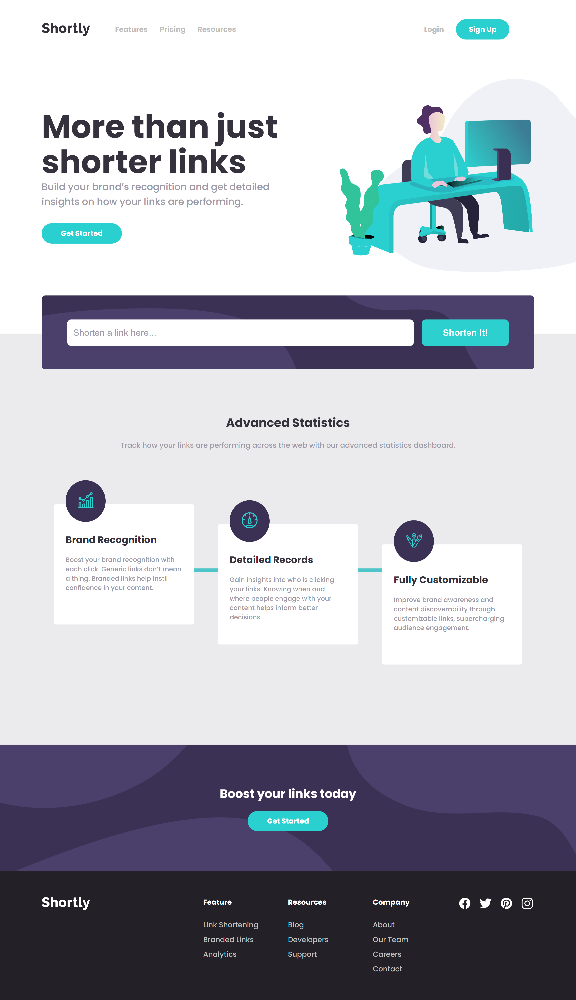
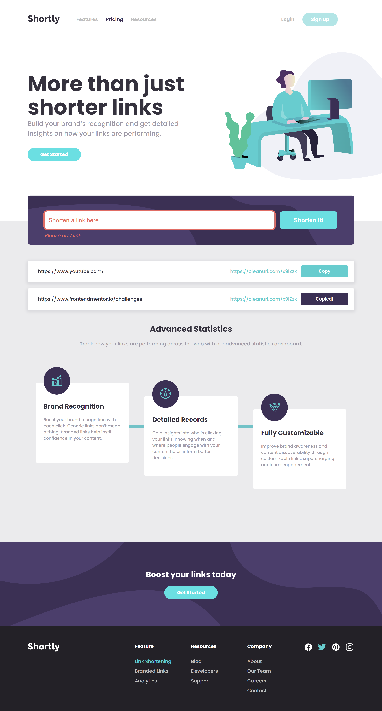
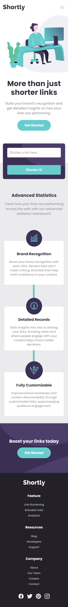
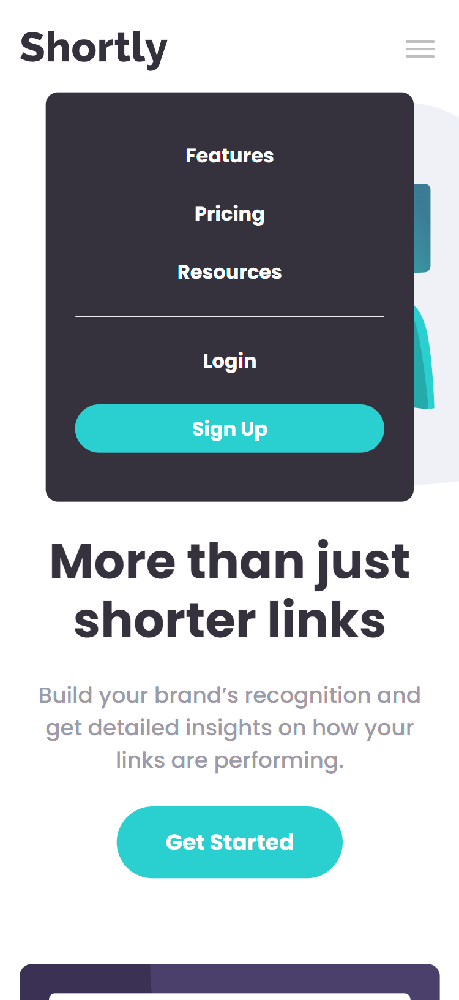
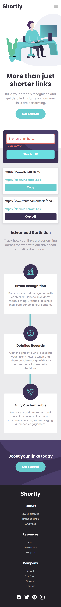

# Frontend Mentor - Shortly URL shortening API Challenge solution

This is a solution to the [Shortly URL shortening API Challenge challenge on Frontend Mentor](https://www.frontendmentor.io/challenges/url-shortening-api-landing-page-2ce3ob-G). Frontend Mentor challenges help you improve your coding skills by building realistic projects.

## Table of contents

- [Overview](#overview)
  - [The challenge](#the-challenge)
  - [Screenshot](#screenshot)
  - [Links](#links)
- [My process](#my-process)
  - [Built with](#built-with)
  - [Continued development](#continued-development)
  - [Useful resources](#useful-resources)
- [Author](#author)
- [Acknowledgements](#acknowledgements)

## Overview

### The challenge

Users should be able to:

- View the optimal layout for the site depending on their device's screen size
- Shorten any valid URL
- See a list of their shortened links, even after refreshing the browser
- Copy the shortened link to their clipboard in a single click
- Receive an error message when the `form` is submitted if:
  - The `input` field is empty

### Screenshot

### Links

- Solution URL: (https://github.com/ygabdn29/url-shortening-landing)
- Live Site URL: (https://ygabdn29.github.io/url-shortening-landing/)

## My process

### Built with

- HTML5 markup
- SCSS
- Flexbox
- CSS Grid
- Mobile-first workflow

### Continued development

- I think the way I handle adding shortened link to the page and how I handle the error message can be improved
- Adding more breakpoint so that the design more responsive to more resolution

### Useful resources

- [MDN](https://developer.mozilla.org/en-US/)
- [StackOverflow](https://stackoverflow.com/)

## Author

- Yoga Budiman

### Acknowledgements

- Thanks to @Shaswat0707 for helping me with the API problem I had before. Now the shorting URL functionality can be used.
